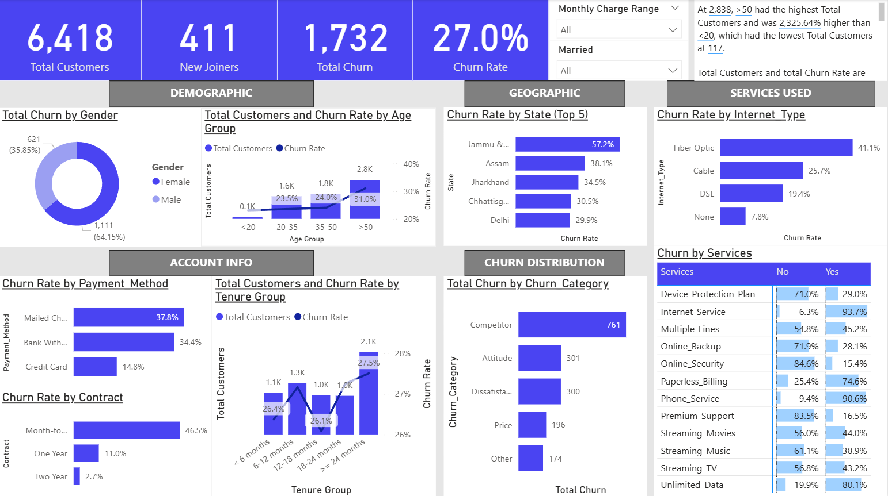

# Customer Churn Analysis & Prediction
##  Dashboard Preview

##  Project Overview

This project addresses a critical business question: What factors contribute to customer churn, and how can we predict and mitigate it? By analyzing customer data, we aim to identify patterns and predictors of churn in a subscription-based business model.

Utilizing machine learning techniques, we develop a predictive model to estimate the likelihood of a customer churning. An interactive dashboard is also created to visualize key metrics and insights, facilitating data-driven decision-making.

## Key Business Metrics Analyzed

-> Churn Rate: The percentage of customers who leave within a given time period.

-> Customer Lifetime Value (CLTV): The predicted net profit attributed to the entire future relationship with a customer.

-> Monthly Recurring Revenue (MRR): The predictable revenue generated from customers on a monthly basis.

-> Customer Acquisition Cost (CAC): The cost associated with acquiring a new customer.

-> Tenure: The duration a customer has been with the company.

## Insights Across Segments

-> Contract Type: Customers on month-to-month contracts exhibit higher churn rates compared to those on annual contracts.

-> Payment Method: Customers using electronic check payments are more likely to churn.

-> Tech Support: Lack of tech support correlates with increased churn.

-> Internet Service: Fiber optic users show a higher propensity to churn.

## Predictive Modeling Approach

A logistic regression model is employed to predict churn likelihood. The model is trained on customer demographics, account information, and service usage patterns. Key features influencing churn include tenure, contract type, payment method, and tech support.

## Dashboard Features

-> Churn Rate Visualization: Displays churn rate over time and by customer segments.

-> Customer Segmentation: Breaks down churn by demographics and service usage.

-> Predictive Insights: Highlights customers at high risk of churning.

-> Revenue Impact: Estimates potential revenue loss due to churn.

## Recommendations for Business Teams

-> Enhance Customer Support: Invest in robust tech support to reduce churn.

-> Review Pricing Strategies: Evaluate the impact of payment methods on churn and consider offering incentives for preferred payment options.

-> Focus on High-Risk Segments: Implement targeted retention strategies for customers identified as high-risk by the predictive model.

-> Monitor Contract Types: Encourage customers to transition from month-to-month to longer-term contracts to improve retention.
